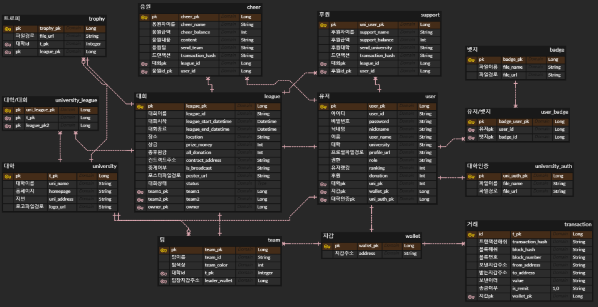
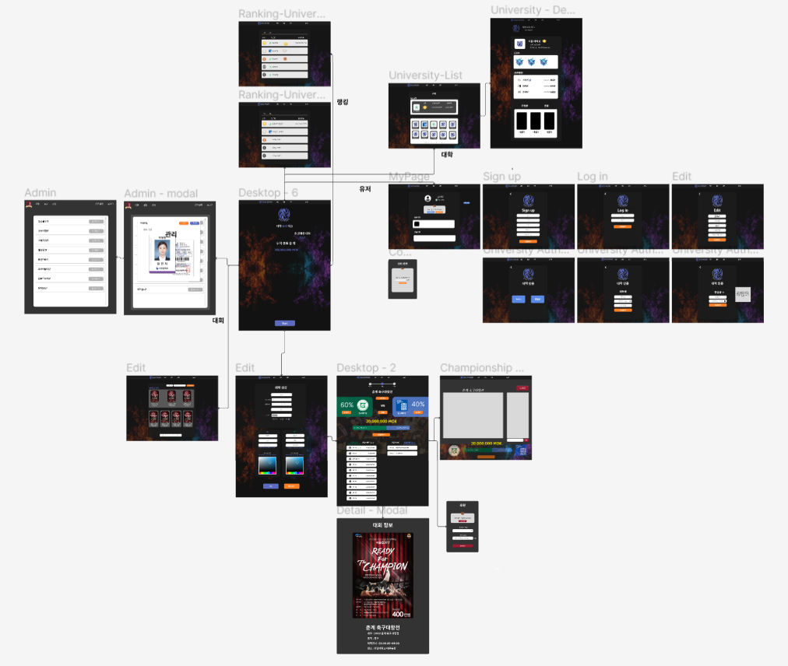
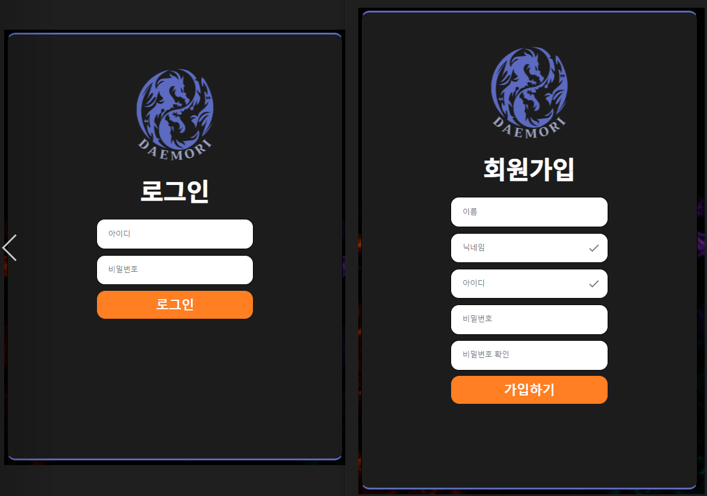
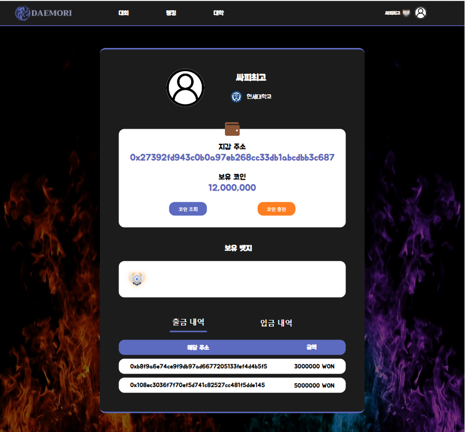
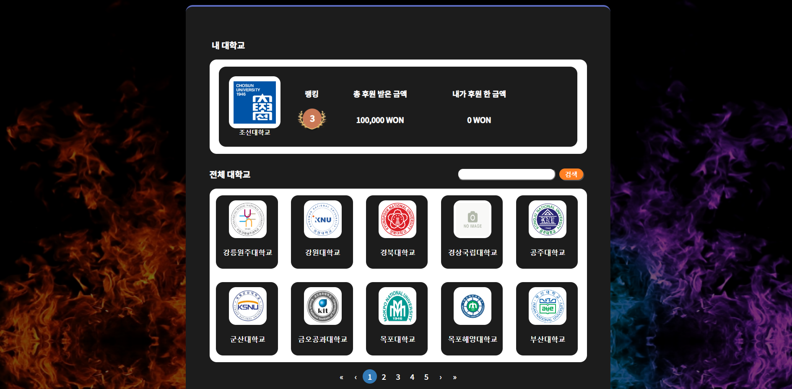
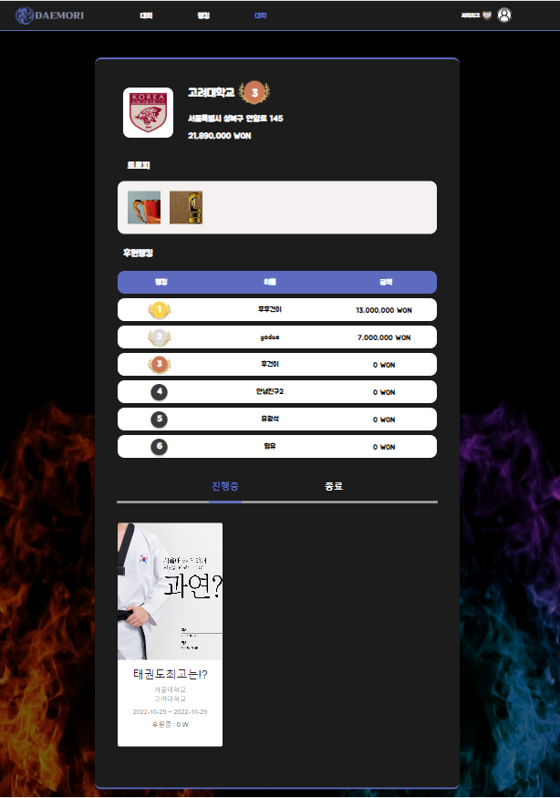
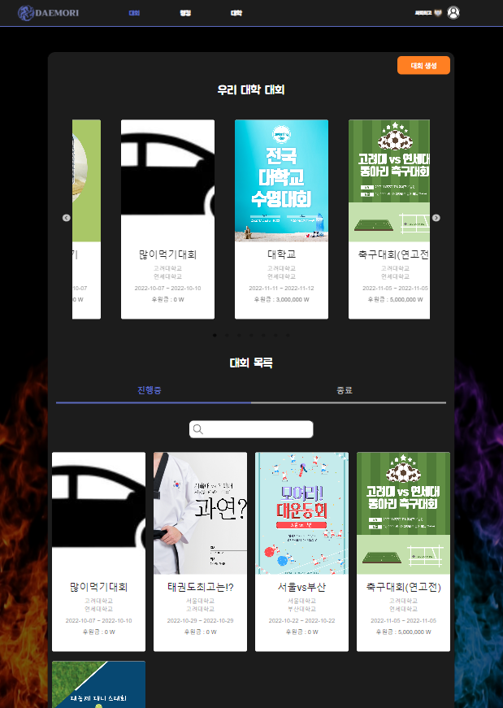
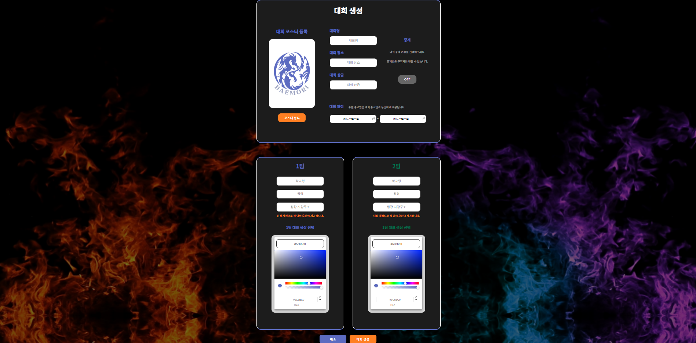
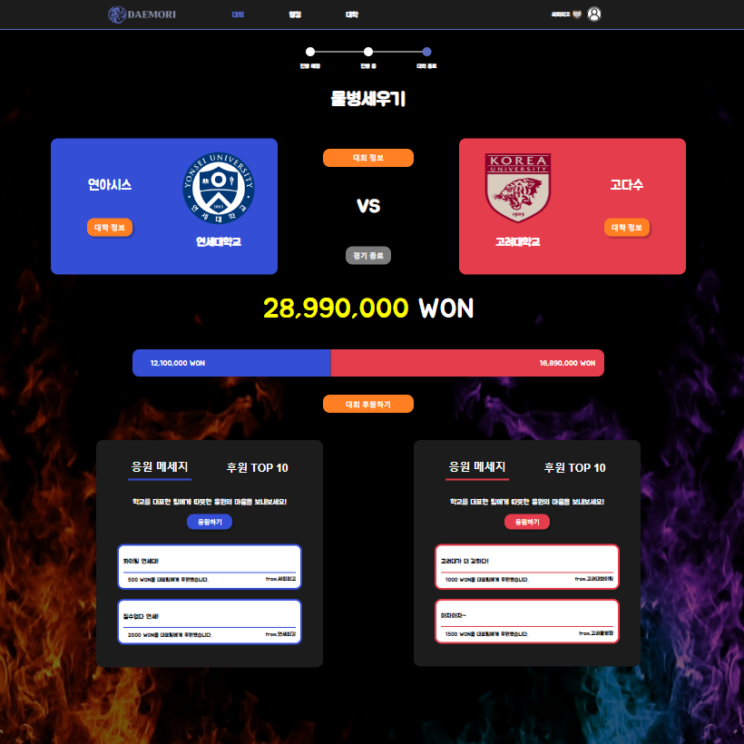
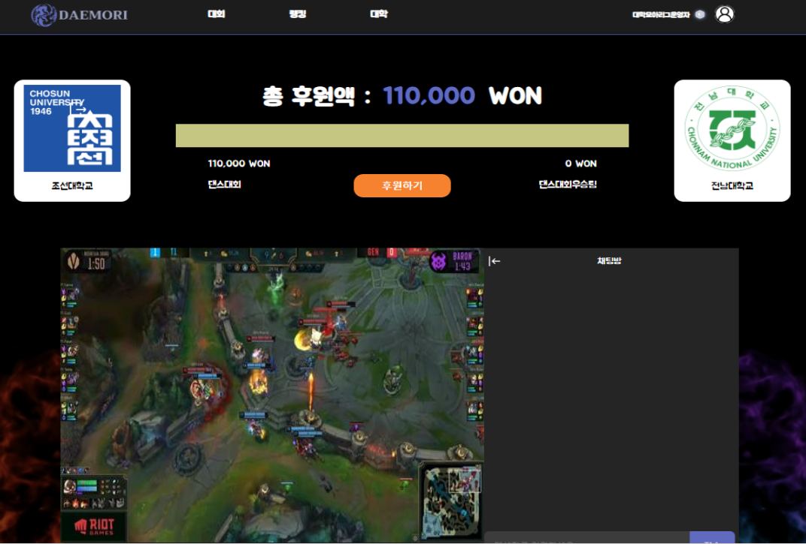

# DAEMORI - 대학모아리그(대모리)

---

---

## 📃 카테고리

| Application                         | Domain                                | Language                       | Framework                            |
| ----------------------------------- | ------------------------------------- | ------------------------------ | ------------------------------------ |
| :white_check_mark: Desktop Web      | :black_square_button: AI              | :white_check_mark: JavaScript  | :black_square_button: Vue.js         |
| :black_square_button:obile Web      | :black_square_button: Big Data        | :white_check_mark:  TypeScript | :white_check_mark: React             |
| :black_square_button:Responsive Web | :white_check_mark: Blockchain         | :black_square_button: C/C++    | :black_square_button: Angular        |
| :black_square_button: Android App   | :black_square_button: IoT             | :black_square_button: C#       | :white_check_mark: Node.js           |
| :black_square_button: iOS App       | :black_square_button: AR/VR/Metaverse | :black_square_button: Python   | :black_square_button: Flask/Django   |
| :black_square_button: Desktop App   | :black_square_button: Game            | :white_check_mark: Java        | :white_check_mark: Spring/Springboot |
|                                     |                                       | :black_square_button: Kotlin   |                                      |

---

## 🗯팀 소개

|                            홍석호                            |                            이민재                            |                            이건후                            |                            이성조                            |                            김성민                            |                            유광석                            |
| :----------------------------------------------------------: | :----------------------------------------------------------: | :----------------------------------------------------------: | :----------------------------------------------------------: | :----------------------------------------------------------: | :----------------------------------------------------------: |
|  |  |  |  |  |  |
|                          BE, Leader                          |                      BE, BE Tech Leader                      |                     FE, FE Tech  Leader                      |                          FE, Design                          |                            FE, QA                            |                        FE, BlockChain                        |

---

## ❓ 기획의도

- 대학 학생회, 동아리 등 여러 단체에서 일어나는 **잦은 횡령 문제**의 해결
- 대회 주최자 및 후원 측에 있어서 **투명한 상금 및 후원금**의 관리의 필요성
- 비대면 상황에서의 **대회 중계**를 통한 관전 및 **실시간 후원**, 승리 및 후원을 통한 여러 **리워드**를 통한 동기 부여

---

## 💡 프로젝트 소개

***- 신뢰성있는 대회 · 재미있는 대회 · 의미있는 대회 -***

- 블록체인을 활용하여 대학간 대회를 개최하고 후원하여 **신뢰성 있는 대회**를 개최 할 수 있습니다. 😁
- 후원을 통해 **뱃지**를 획득하고, **랭킹시스템**을 통해 경쟁 할 수 있습니다. 🥇
- 승리팀은 **AI**(Text To Image)를 통해 자신만의 고유성·유일성·희소성을 보장하는 트로피 **NFT**를 획득 할 수 있습니다. 🏆

---

## 🔧 기술 스택 & 서비스 아키텍쳐

#### - 기술스택

  <table>
    <tr>
        <td><b>Back-end</b></td>
        <td>
                      
          
          
          
           
          
          
           
          
          
        </td>
    </tr>
    <tr> 
      <td><b>Front-end</td>
      <td>
      
      
      
      
      
       
      </td>
    <tr>
    <td><b>Tools</td>
      <td>
      
        
      
      

        
      </td>
    </table>  
  

#### - 서비스 아키텍쳐

---

## 🎨 ERD & 와이어 프레임

#### ERD ([DAEMORI](https://www.erdcloud.com/d/HD3AP3S5myi6ze6qg))

#### 와이어 프레임([Figma](https://www.figma.com/file/czwpBPGXImjIMZIxSbMbcA/%EB%8C%80%EB%AA%A8%EB%A6%AC?node-id=224%3A248))

---

## 🔑 핵심 기술

### 블록체인🔒

Geth를 통해 **Private BlockChain Server** 구축하여 ERC-20 규약을 지킨 **WON 토큰 배포**.

**스마트 컨트랙트**를 통해 **투명성**과 **신뢰성**을 지켜 후원금을 전달.

**Web3j**와 **Web3.js**를 통해 블록체인 서버를 이용한 **DApp** 개발.

### NFT🏆

### 

 

**DeepAI** 라이브러리에서 제공하는 **Text To Image API**를 통해 트로피를 제작.

**ERC-721 규약을 지킨 NFT**로 블록체인 네트워크에 배포.

### OpenVidu🎥 

### 

**OpenVidu** 라이브러리를 통해 카메라와 화면 공유를 통한 **실시간 중계**, **실시간 채팅**을 구현

---

## 🔎 서비스 소개

## 유저 🙋‍♂️

### 로그인, 회원가입

- **로그인**과 **회원가입**을 통해 서비스를 이용할 수 있습니다.

### 마이페이지

- 대학을 등록하지 않았을 시 **대학 등록**을 할 수 있으며 등록 후 프로필에 반영 되고, **프로필 사진을 변경** 할 수 있습니다.

- 코인지갑을 생성하고, **코인 조회**와 **코인 충전**을 통해 WON코인을 조회·충전 할 수 있습니다.

- 후원금에 따라 달라지는 **뱃지**를 확인 할 수 있습니다.

- **블록체인**을 통한 **투명한 입·출금 내역**과 입·출금자의 지갑 주소를 확인 할 수 있습니다.

---

## 대학 🕍

### 대학 리스트

- **대학 등록**을 하지 않았을 시 대학 등록 버튼이 나오게 됩니다.
- 내 대학교 탭을 통해 **내 대학의 랭킹**, **총 후원받은 금액**, **내가 후원 한 금액**을 확인 할 수 있습니다.
- 전체 대학교 탭을 통해 등록 된 대학들을 **검색** 할 수 있으며 클릭 시 **해당 대학 상세 페이지로 이동** 할 수 있습니다.

### 대학 상세

- 대학 이름을 클릭 할 시 해당 **대학 홈페이지로 이동**할 수 있습니다.

- **대학의 랭킹**과, 해당 대학이 **현재까지 획득한 후원금**을 확인 할 수 있습니다.

- 해당 대학이 획득한 **트로피 NFT**를 확인할 수 있고, 해당 대학에 후원한 **후원자들의 랭킹**, **진행중·종료 된 대회**를 확인 할 수 있습니다.

---

## 대회 🥇

### 대회 리스트

- 대회 생성 버튼을 통해 **대회 생성**을 할 수 있고, 내 대학의 **진행중·종료된 대회**들을 확인 할 수 있습니다.

  

### 대회 생성

- 포스터 등록과 각 항목을 입력하여 **대회를 생성** 할 수 있고, 해당 대학의 시그니쳐 컬러를 등록할 수 있습니다.

### 대회 상세

- 대회가 진행 중일 때 개최자가 아닌 유저에게는 중계중인 대회는 중계버튼을 통해 **중계**를 볼 수 있습니다.
- 개최자는 대회의 상태를 **진행중 -> 종료로 변경** 할 수 있습니다.
- 개최자가 대회를 종료 할 때, 개최자는 승리 한 팀을 선택하여 승리 팀에게 모인 **후원금을 전달** 할 수 있습니다.

- 대회 후원과, 응원 메세지를 통해 **후원금을 전달** 할 수 있고, 후원금액은 **실시간으로 반영**됩니다.

- 후원 TOP 10 탭을 통해 현재까지 **후원 한 사람들의 랭킹**을 확인 할 수 있습니다.

  

### 중계

- 개최자는 중계방을 생성하여 해당 대회에 대한 **중계를 진행** 할 수 있습니다.
- 일반 유저는 중계방에 입장하여 **채팅**을 남길 수 있습니다.

---

## 관리 📑

### 회원 관리 & 대학 인증

- **회원 관리 할 수 있는 계정을 통해 접근** 할 수 있으며, 권한이 없을 시 다시 초기 페이지로 돌아옵니다.
- 대학 인증을 하며 보낸 파일을 확인하여 **유저의 권한을 변경**을 할 수 있습니다.

