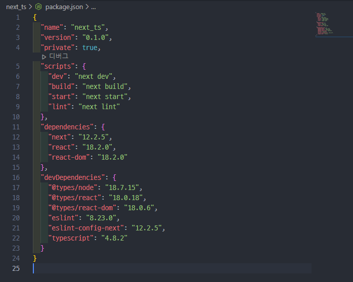

# Next.js & TS 환경설정

## 초기 설정

→ Next.js, TS 초기 설치 (@latest ← 최신 버전 설치)

`npx create create-next-app@latest --typescript`

→ 실행 명령어

`npm run dev`

package.json 확인



Next.js + TypeScrtipt

- typescript 관련 파일들이 설치
- 파일 확장자 명이 .tsx로 생성

파일 구조

```
|-- .next
|-- node_modules
|-- pages
|-- public
|-- styles
|-- .eslintrc.json
|-- next.config.js
|-- .gitignore
|-- package-lock.json
|-- package.json
|-- README.md
```

- .eslintrc.json
  - ESLint 설정 파일
- next.config.js
  - Next.js 프로젝트 설정 파일

## 페이지 생성

1. page 폴더 안의 모든 파일 삭제

2. index.tsx 생성
   
   ```jsx
   export default function home () {
       return 'ts'
   }
   ```

3. next.js 에서 pages 폴더는 라우터의 기능 (파일 이름이 곧 주소 창의 경로)
   
   1. about.tsx
      
      ```jsx
      export default function about () {
          return "about"
      }
      ```
      
       위와 같이 pages폴더 안에 about.tsx 파일을 생성하게 된다면 `http://localhost:3000/about` 로 접근이 가능.

4. 파일 생성 시 export default가 꼭 지정돼야 함 ([https://quark21.tistory.com/314](https://quark21.tistory.com/314))