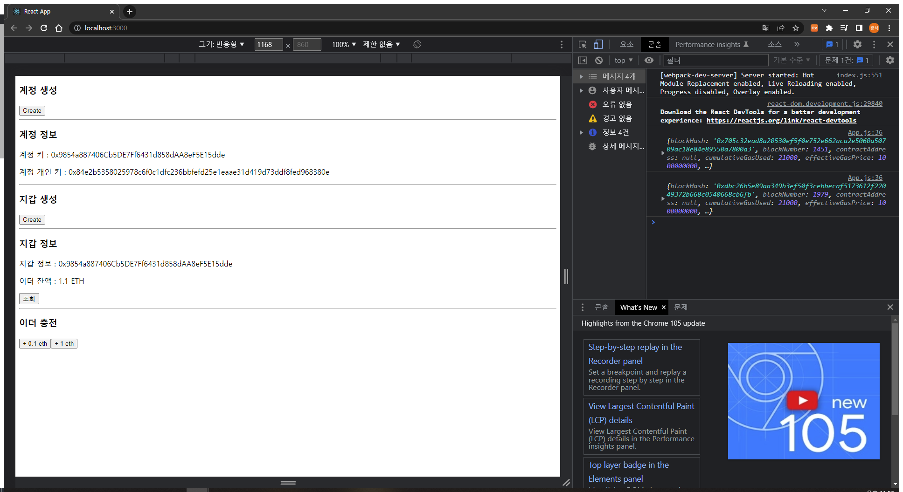

# Req 2

**CRA 설정** https://github.com/ChainSafe/web3.js/blob/1.x/README.md (참고)

* 초기 cra 설정시 오류가 나는데 cra 5버전 부터 이전 버전 지원을 못하는 ? 그런 오류

* If you are using create-react-app version >=5 you may run into issues building. This is because NodeJS polyfills are not included in the latest version of create-react-app.

* web3 import, 로컬 연결


**계정 생성**

```js
  const createAccount = () => {
    const createdObj = web3.eth.accounts.create(); // 개인키, 기본키를 가진 계정 오브젝트 생성
    const account = web3.eth.accounts.privateKeyToAccount(
      createdObj.privateKey
    ); // 개인키를 통해 계정을 생성
    setUserAccount(account);
  };

//returned
> {
    address: "0xb8CE9ab6943e0eCED004cDe8e3bBed6568B2Fa01",
    privateKey: "0x348ce564d427a3311b6536bbcff9390d69395b06ed6c486954e971d960fe8709",
    signTransaction: function(tx){...},
    sign: function(data){...},
    encrypt: function(password){...}
}
```

**지갑 생성**

```js
  const createWallet = () => {
    setUserWallet(web3.eth.accounts.wallet.add(userAccount)); // 유저 계정에 지갑 추가, create()도 있는데 이건 뭐지?
  };

//returned
> {
    index: 0,
    address: '0x2c7536E3605D9C16a7a3D7b1898e529396a65c23',
    privateKey: '0x4c0883a69102937d6231471b5dbb6204fe5129617082792ae468d01a3f362318',
    signTransaction: function(tx){...},
    sign: function(data){...},
    encrypt: function(password){...}
}
```

**잔액 조회**

```js
  const getWalletBalance = () => {
    web3.eth
      .getBalance(userWallet.address) // wei 단위의 잔액 조회
      .then((balance) => setUserBalance(web3.utils.fromWei(balance, "ether"))); // promise 객체로 ether 단위 반환
  };
```

**이더 충전**

```js
  const chargeEth = (price) => {
    const Eth = web3.utils.toWei(String(price), "ether"); // 이더 단위를 wei단위로 바꾸기, price는 string으로 변환하여 입력
    const tx = {
      from: "0x2d2947a42f5f8f51fe21c627d9e77f76a273c4c4",
      to: userWallet.address,
      value: Eth,
    };
    web3.eth.sendTransaction(tx).then((receipt) => console.log(receipt)); // tx 객체를 전송
  };
```


**결과 화면**




**전체 코드**

```js
import { useState, React } from "react";
import Web3 from "web3";

function App() {
  const [userAccount, setUserAccount] = useState();
  const [userWallet, setUserWallet] = useState();
  const [userBalance, setUserBalance] = useState();

  const web3 = new Web3("http://localhost:8545");

  const createAccount = () => {
    const createdObj = web3.eth.accounts.create();
    const account = web3.eth.accounts.privateKeyToAccount(
      createdObj.privateKey
    );
    setUserAccount(account);
  };

  const createWallet = () => {
    setUserWallet(web3.eth.accounts.wallet.add(userAccount));
  };

  const getWalletBalance = () => {
    web3.eth
      .getBalance(userWallet.address)
      .then((balance) => setUserBalance(web3.utils.fromWei(balance, "ether")));
  };

  const chargeEth = (price) => {
    const Eth = web3.utils.toWei(String(price), "ether");
    const tx = {
      from: "0x2d2947a42f5f8f51fe21c627d9e77f76a273c4c4",
      to: userWallet.address,
      value: Eth,
    };
    web3.eth.sendTransaction(tx).then((receipt) => console.log(receipt));
  };

  return (
    <div>
      <h3>계정 생성</h3>
      <button onClick={createAccount}>Create</button>
      <hr />
      <h3>계정 정보</h3>
      <p>계정 키 : {userAccount ? userAccount.address : null}</p>
      <p>계정 개인 키 : {userAccount ? userAccount.privateKey : null} </p>
      <hr />
      <h3>지갑 생성</h3>
      <button onClick={createWallet}>Create</button>
      <hr />
      <h3>지갑 정보</h3>
      <p>지갑 정보 : {userWallet ? userWallet.address : null}</p>
      <div>
        <p>이더 잔액 : {userBalance ? userBalance : "???"} ETH</p>
        <button onClick={getWalletBalance}>조회</button>
      </div>
      <hr />
      <h3>이더 충전</h3>
      <div>
        <button onClick={() => chargeEth(0.1)}>+ 0.1 eth</button>
        <button onClick={() => chargeEth(1)}>+ 1 eth</button>
      </div>
    </div>
  );
}

export default App;

```

